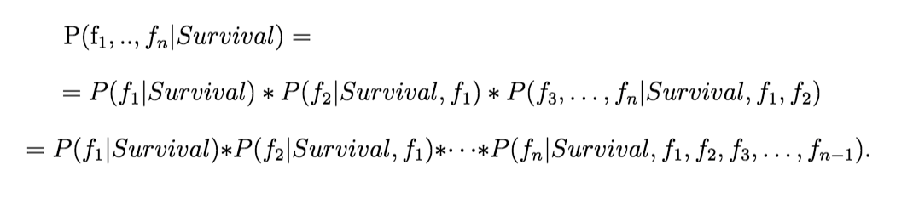

# Naive Bayes Exercise

In this exercise you will practice the usage of the Naive Bayes statistical classification algorithm.

## How Does it Work?

The Naive Bayes classifier aggregates information using conditional probability with an assumption of independence among features. What does it mean? For example, it means we have to assume that the comfort of the room on the Titanic is independent of the fare ticket. This assumption is absolutely wrong and it is why it is called Naive. It allows to simplify the calculation, even on very large data-sets. Let’s find why.

The Naive Bayes classifier is based on finding functions describing the probability of belonging to a class given features. We write it P(_Survival_ | _f1_,…, _fn_). We apply the Bayes law to simplify the calculation:

P(Survival) is easy to compute and we do not need P( f1,…, fn) to build a classifier. It remains P(f1,…, fn | Survival) calculation. If we apply the conditional probability formula to simplify calculation again:

Each calculation of terms of the last line above requires a dataset where all conditions are available. To calculate the probability of obtaining f_n given the Survival, f_1, …, f_n-1 information, we need to have enough data with different values of f_n where condition {Survival, f_1, …, f_n-1} is verified. It requires a lot of data. We face the curse of dimensionality. Here is where the Naive Assumption will help. As feature are assumed independent, we can simplify calculation by considering that the condition {Survival, f_1, …, f_n-1} is equal to {Survival}:

Finally to classify a new vector of features, we just have to choose the Survival value (1 or 0) for which P(f_1, …, f_n|Survival) is the highest:

## The Exercise

You are given a data-set from the titanic disaster containing some information about the people who boarded the ship and whether they have survived or not.

To accomplish this task you are given two files in the data folder, one for training, `train.csv`, and one for testing, `test.csv`. Those files contain the classification (whether or not they have survived), under the `survived` column, and some features about each personnel, like their `Sec`, `Age`, `Fare` and more.

Here is a table explaining the columns in both data files:

| Variable Name | Definition | Key |
|---------------|------------|-----|
| survival      | Survival | 0 = No, 1 = Yes |
| pclass        | Ticket class | 1 = 1st, 2 = 2nd, 3 = 3rd |
| sex           | Sex | |
| Age           | Age in years | |
| sibsp         | # of siblings / spouses aboard the Titanic | |
| parch         | # of parents / children aboard the Titanic | |         
| fare          | Passenger fare | |
| cabin         | Cabin number | |
| embarked      | Port of embarkation | C = Cherbourg, Q = Queenstown, S = Southampton |

Of course some features might not be relevant, experience with how including/excluding some features might affect the output results.

One possible solution can be found in the `solution.py` module, but it's obviously not recommended to jump straight to the solution, but rather try implementing this yourself.

## Hints

You will need to implement several functions that will allow you to classify people in the `test.csv` file:
